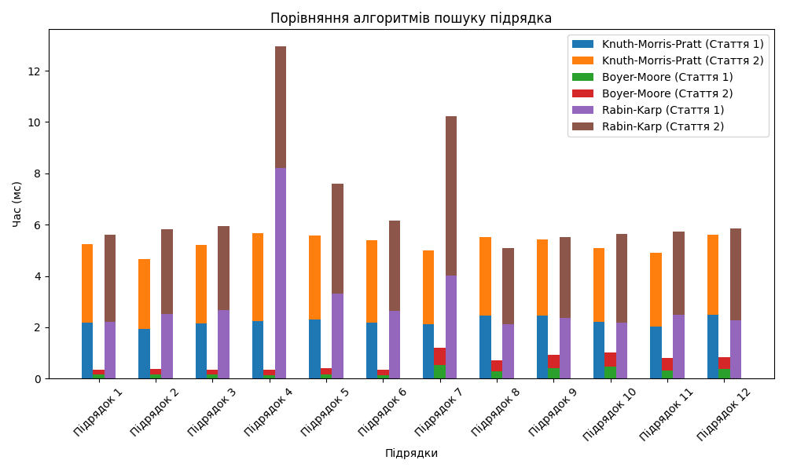

# Порівняння алгоритмів пошуку підрядка

## Результати експерименту

В рамках експерименту проведено тестування трьох алгоритмів пошуку підрядка: **Knuth-Morris-Pratt**, **Boyer-Moore** та **Rabin-Karp**. Для кожного з алгоритмів було проаналізовано час виконання та позиції знайдених підрядків у двох текстах. Метою експерименту було визначити, який з алгоритмів є найбільш ефективним для кожного тексту.

### Загальні результати (середні значення)

| Алгоритм               | Час (Стаття 1) | Час (Стаття 2) |
| ---------------------- | -------------- | -------------- |
| **Knuth-Morris-Pratt** | 2.223 ms       | 3.038 ms       |
| **Boyer-Moore**        | 0.352 ms       | 0.441 ms       |
| **Rabin-Karp**         | 2.344 ms       | 3.452 ms       |

### Аналіз результатів

- **Boyer-Moore** показав найкращі результати в обох статтях, що свідчить про його високу ефективність у пошуку підрядків. Час виконання цього алгоритму значно менший у порівнянні з іншими алгоритмами.
- **Knuth-Morris-Pratt** має конкурентоспроможну продуктивність, але у всіх випадках працює повільніше, ніж Boyer-Moore. Він зазвичай виявляє підрядки, але з більшим часом виконання.

- **Rabin-Karp** демонструє помірну швидкість у порівнянні з Knuth-Morris-Pratt, особливо у статті 2. Його час виконання є найгіршим з трьох алгоритмів для обох текстів.

### Висновки

На основі проведеного аналізу можна зробити такі висновки:

1. **Найшвидший алгоритм**: Boyer-Moore є найшвидшим алгоритмом для обох статей. Його час виконання у декілька разів менший, ніж у Knuth-Morris-Pratt та Rabin-Karp.

2. **Knuth-Morris-Pratt**: Хоча Knuth-Morris-Pratt і показує задовільні результати, він не є найефективнішим алгоритмом в даному випадку.

3. **Rabin-Karp**: Цей алгоритм має найбільші затримки у виконанні, що робить його менш бажаним варіантом для пошуку підрядків в даних текстах.

### Візуалізація результатів

На основі проведених тестів **Boyer-Moore** рекомендується для використання у випадках, де швидкість пошуку є критично важливою. Інші алгоритми можуть бути доречними в специфічних випадках, але загалом вони поступаються **Boyer-Moore** в ефективності.
